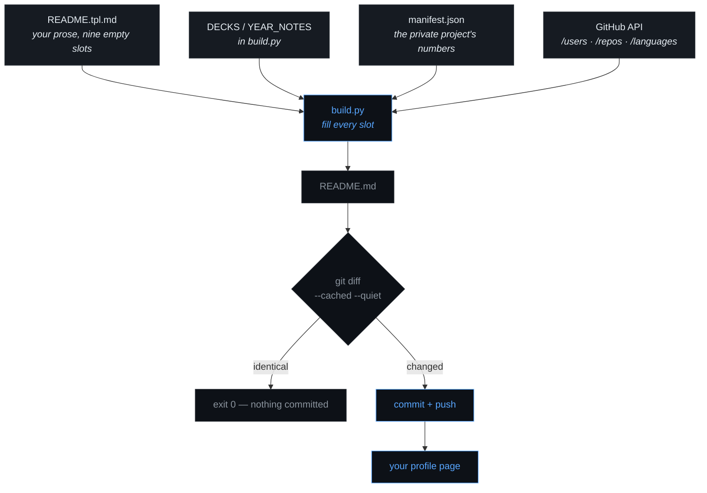
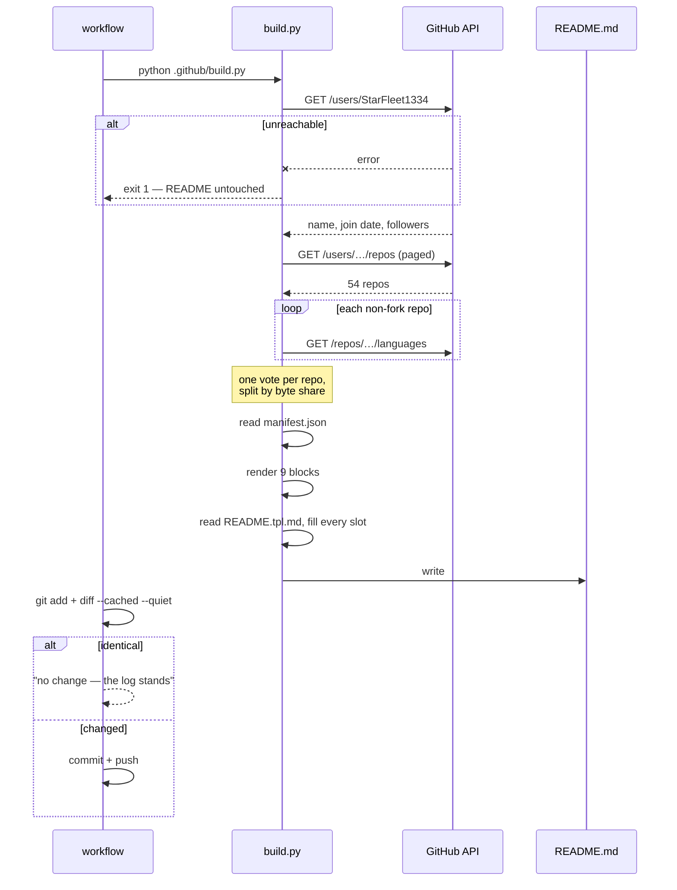
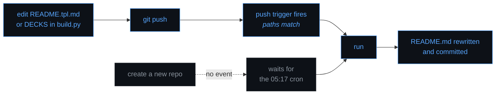

# How the log stays current

The whole mechanism in one sentence: **a template with holes in it, a script
that fills the holes from the GitHub API, and a workflow that commits the
result only when the bytes actually changed.**



---

## 1 · What starts a run

| trigger | when | latency |
|:--|:--|:--|
| **cron** `17 5 * * *` | every day, 05:17 UTC | up to 24 h |
| **push** to `main` or `master` | only if it touches `README.tpl.md`, `manifest.json`, `.github/build.py`, or `.github/workflows/log.yml` | seconds |
| **workflow_dispatch** | Actions → log → Run workflow | immediate |

An odd minute is deliberate. Everything scheduled on the hour lands in the same
GitHub queue, and a busy queue is how a cron silently slips by twenty minutes.

**It must be the repo named after you.** GitHub renders the profile Overview
from `StarFleet1334/StarFleet1334` and nowhere else. The same files in a repo
called anything else are just files — the workflow will still run and still
commit, and the profile page will still not change.

**Note what is *not* a trigger.** Creating a repo, pushing to a different repo,
gaining a follower — none of these reach this workflow. GitHub has no event for
"something happened elsewhere on my account". Those changes are noticed by the
next daily run, which is why the cron exists at all.

`concurrency: { group: log }` means two runs never overlap. A manual run fired
while the cron is mid-flight queues behind it rather than racing it to the same
branch.

---

## 2 · What happens inside a run



Step by step, as the Actions log shows it:

1. **checkout** — the repo at `main`.
2. **setup-python 3.12** — no `pip install`; `build.py` is stdlib only, so
   there is no dependency that can rot or go missing.
3. **rebuild the log** — `build.py` with `GITHUB_TOKEN` (5000 calls/hr) and
   `PROFILE_USER` taken from `github.repository_owner`, so the script is not
   hard-wired to one account.
   - one call for the user, one or two for the repo list, one per non-fork repo
     for languages — about **56 calls**, roughly 1% of the hourly budget.
   - each block is rendered, the template is read, every `<!--LOG:x-->` slot is
     filled by regex, the leading comment is swapped for a *generated file* banner.
   - `README.md` is written.
4. **commit, only if something moved** — `git add README.md`, then
   `git diff --cached --quiet`. Nothing staged means nothing to say: the step
   prints `no change — the log stands` and exits 0. The run is still green.

Total wall clock is well under a minute.

The commit, when there is one, is authored by `github-actions[bot]` and its
message is the diffstat itself:

```
log: 1 file changed, 4 insertions(+), 4 deletions(-)
```

Not a fixed string. Scanning the history tells you at a glance which days moved
one line and which day the whole hold was refiled.

---

## 3 · What makes a run actually commit

This is the useful table. Each slot has exactly one thing that moves it:

| slot | commits when |
|:--|:--|
| `stardate` | repo count changes · the top four languages reorder · your newest repo changes · `heading` in `manifest.json` changes |
| `badges` | public repo count or follower count changes |
| `surface` | `manifest.json` is re-measured |
| `timeline` | a repo is created in a year with no `YEAR_NOTES` line, or you edit one |
| `systems` | language byte shares shift enough to reorder the bars or move a `▰` |
| `hold` | a repo named in `DECKS` is created, deleted or renamed |
| `arrivals` | a new repo appears that is not yet filed into a deck |
| `recent` | **any push to any public repo** — this is the one that moves most often |
| `stamp` | the date or name of your newest push changes |

So in practice: **on a day you pushed to any public repo, the 05:17 run
commits.** On a day you did not, it does not. That is the intended behaviour,
not a coincidence — and it is why the footer stamp is your newest real push and
not `datetime.now()`. A "generated on" line would make every single run
different, and the commit history would become a year of noise that says
nothing about your work.

### Why the bot cannot loop

The commit step pushes `README.md`. Two independent things stop that from
starting another run:

1. **The paths filter.** `on: push` lists the template, the manifest, the
   script and the workflow. `README.md` is not among them.
2. **GitHub's own rule.** A push authenticated with `GITHUB_TOKEN` does not
   trigger workflows, by design, precisely to prevent this.

Either one alone would be enough. Both are in place because a self-triggering
workflow is expensive and embarrassing to discover.

### Why the profile repo is excluded from itself

`work()` in `build.py` drops any repo whose name equals the account name before
computing "newest", "recent" and the stamp.

Without it the Action's own push makes `StarFleet1334` permanently the most
recently pushed repo on the account. The header would read *last seen in
StarFleet1334* forever, and the stamp would advance on every run — so every run
would commit, and the no-clock design would be worth nothing. This was a real
bug in the first version, caught by a live run.

---

## 4 · When it goes wrong

| symptom | cause | what happens to README.md |
|:--|:--|:--|
| **no run appears at all** after a push | the branch is not in the `branches:` filter, or the push touched only files outside `paths:` | untouched — nothing ran |
| runs are green, **profile page never changes** | the files are in a repo not named `StarFleet1334` | updated, in a repo GitHub does not read for the Overview |
| job red at **rebuild the log** | GitHub API unreachable | **untouched** — `build.py` returns 1 before writing anything |
| job red at **commit** with `403` | workflow permissions are read-only | untouched on the remote; the correct file existed only in the runner |
| bars look coarse, log says `only 41/54 repos measured` | some `/languages` calls failed | written, but with repo counts instead of byte shares |
| log says `template has no slot for: x` | a block was added to `build.py` without a slot in the template | written, minus that block |
| log says `template asks for unknown blocks: x` | a slot exists with no block behind it | written, that slot left empty |

The rule underneath all five: **a partial answer is never silently passed off as
a complete one.** A language read that only covered three quarters of the
account is discarded in favour of the coarse measure rather than ranked as if
it were whole, and an API that cannot be reached stops the build instead of
producing a README full of zeroes.

**To read a run:** Actions → log → the run → *rebuild the log*. Every line the
script prints starts with `-` for progress and `!` for a problem it worked
around.

---

## 5 · Changing it



**Prose** → edit `README.tpl.md`, push. Never edit `README.md`; the next run
overwrites it and your change is gone with no warning.

**Filing a new repo** → one line in `DECKS`:

```python
(["my-new-thing"], "what it is, in one clause"),
```

Push. The push matches `.github/build.py`, so the run is immediate and the repo
moves out of NEW ARRIVALS into the deck table.

**A repo you never want listed** → add its name to `IGNORE`.

**A new year** → a line in `YEAR_NOTES`. Forget, and the timeline lists that
year's repos instead. It cannot silently stop.

**AETHER's numbers** → the API cannot see a private repo, so they arrive by
hand:

```bash
python .github/manifest.py C:/Users/User/Desktop/secret/aether
git commit -am "log: remeasure" && git push
```

That walks the real tree (skipping `.venv`, `data`, `__pycache__`), writes the
counts into `manifest.json`, and the push triggers a run.

**Preview locally** before any of it:

```bash
python .github/build.py --check    # would README.md change?
python .github/build.py            # write it
```

Unauthenticated you get 60 API calls an hour and a build needs ~56, so the
second run inside an hour will hit the limit and fall back to coarse counts.
Export `GITHUB_TOKEN` (a personal access token, no scopes needed for public
data) to get the full 5000.
