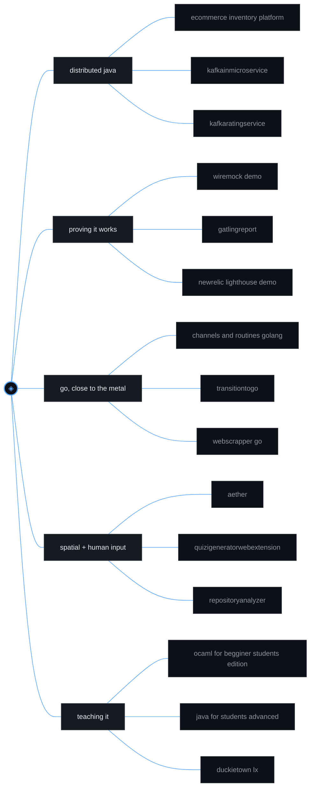
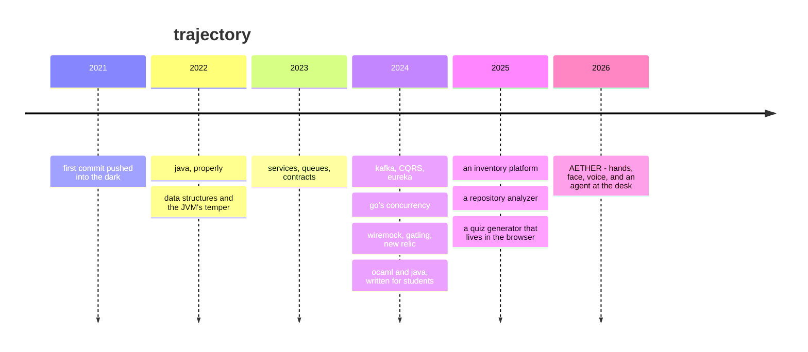

<!--
  GENERATED FILE — do not edit.
  Written by .github/build.py from README.tpl.md and the GitHub API.
  Edit the template, or the deck data in build.py, and push.
-->

<pre>
<!--LOG:stardate-->
╔══════════════════════════════════════════════════════════╗
║                                                          ║
║        S T A R F L E E T  ·  1 3 3 4                     ║
║        open log / flight deck                            ║
║                                                          ║
║   ────────────────────────────────────────────────       ║
║                                                          ║
║   callsign      IDoctor                                  ║
║   on station    since 2021-07-04                         ║
║   manifest      54 public repositories                   ║
║   crewed by     Java · Go · HTML/CSS · Python            ║
║   last seen in  ecommerce-inventory-platform             ║
║   heading       AETHER - hands, face and voice           ║
║                                                          ║
╚══════════════════════════════════════════════════════════╝
<!--/LOG:stardate-->
</pre>

<!--LOG:badges-->

&nbsp;

&nbsp;

<!--/LOG:badges-->

---

## ⌖ &nbsp;CURRENT HEADING

> **AETHER** — a desktop workspace with **no primary mouse**.
> A webcam watches your hands and your face; a headset mic listens; an agent
> sits at the other end of the desk. It ships with an **empty gesture
> vocabulary** and learns yours by watching how you actually move — so the
> dialect is *yours*, not a manual's.

<!--LOG:surface-->
| | |
|---|---|
| **Surface** | 74 Python modules · 66 JS modules · ~82k lines |
| **Spine** | FastAPI over a websocket, vanilla JS, zero framework |
| **Eyes** | MediaPipe hand + face landmarks at frame rate |
| **Ears** | Vosk live preview, Whisper `medium.en` final — fully offline |
| **Rooms** | Canvas · Air Sketch (2D/3D) · Observatory · Codex · Palace · Watchtower · Console |
| **The trick** | A motion repeated ~6× gets *proposed back to you* to bind |
<!--/LOG:surface-->

Also inside: a 2D alt-azimuth <b>Observatory</b> over 8,874 real catalogued stars ·
a <b>Codex</b> that reads a codebase into a force-directed constellation — one star per
module, one arc per import, the pulse travelling importer → imported ·
a <b>Chronosphere</b> that scrubs the whole board backwards through its own history.

---

## ✦ &nbsp;STAR CHART

<!--LOG:chart-->

<!--/LOG:chart-->

---

## ⧗ &nbsp;SHIP'S LOG

<!--LOG:timeline-->

<!--/LOG:timeline-->

---

## ⚙ &nbsp;SYSTEMS ONLINE

Every repository gets one vote, split between its languages by byte share — so no single vendored bundle can outrank a language that was actually written.

<!--LOG:systems-->
| | instrument | where it actually shows up |
|:--|:--|:--|
| `▰▰▰▰▰▰▰▰▰▰` | **Java** | services, CQRS, Kafka, Eureka, chat, CRM |
| `▰▰▰▰▰▱▱▱▱▱` | **Go** | goroutines, scrapers, a file finder, a UI, a clock |
| `▰▱▱▱▱▱▱▱▱▱` | **HTML/CSS** | hand-written, every rule of it |
| `▰▱▱▱▱▱▱▱▱▱` | **Python** | AETHER's entire backend — FastAPI, MediaPipe, Whisper |
| `▰▱▱▱▱▱▱▱▱▱` | **JavaScript** | vanilla, no framework, on purpose |
| `▰▱▱▱▱▱▱▱▱▱` | **Kotlin** | an Android detour |
| `▰▱▱▱▱▱▱▱▱▱` | **Dart** | a chat system that had to run on a phone |
| `▰▱▱▱▱▱▱▱▱▱` | **OCaml** | a teaching language, and a good one |
<!--/LOG:systems-->

---

## ▦ &nbsp;THE HOLD

<!--LOG:hold-->

<b>⚭ &nbsp;ENGINEERING DECK</b> &nbsp;— distributed Java, events, contracts

 

| repo | what it is |
|:--|:--|
| [`ecommerce-inventory-platform`](https://github.com/StarFleet1334/ecommerce-inventory-platform) | the largest of them — inventory, end to end |
| [`KafkaInMicroService`](https://github.com/StarFleet1334/KafkaInMicroService) | Kafka wired through a service boundary |
| [`KafkaRatingService`](https://github.com/StarFleet1334/KafkaRatingService) | ratings as an event stream |
| [`CQRS`](https://github.com/StarFleet1334/CQRS) | command/query separation, taken seriously |
| [`MicroServicesGEureka`](https://github.com/StarFleet1334/MicroServicesGEureka) | discovery with Eureka |
| [`Spring-Boot-MicroService`](https://github.com/StarFleet1334/Spring-Boot-MicroService) | the baseline the rest grew out of |
| [`Tolerant-Streams`](https://github.com/StarFleet1334/Tolerant-Streams) | streams that survive bad input |
| [`SCom`](https://github.com/StarFleet1334/SCom) · [`2Com`](https://github.com/StarFleet1334/2Com) | service-to-service, the plumbing of it |

<b>⌖ &nbsp;SCIENCE DECK</b> &nbsp;— proving it works before claiming it does

 

| repo | what it is |
|:--|:--|
| [`WireMock-Demo`](https://github.com/StarFleet1334/WireMock-Demo) · [`WireMock-Api`](https://github.com/StarFleet1334/WireMock-Api) · [`WireMock-Data`](https://github.com/StarFleet1334/WireMock-Data) | three angles on stubbing a dependency you don't own |
| [`GatlingReport`](https://github.com/StarFleet1334/GatlingReport) | load, measured rather than assumed |
| [`newrelic-lighthouse-demo`](https://github.com/StarFleet1334/newrelic-lighthouse-demo) | observability meeting a front-end budget |
| [`CarinaProject`](https://github.com/StarFleet1334/CarinaProject) | UI automation |
| [`Demo-TestService`](https://github.com/StarFleet1334/Demo-TestService) | the scaffold under all of it |

<b>⚙ &nbsp;PROPULSION</b> &nbsp;— Go, and things that had to be fast or small

 

| repo | what it is |
|:--|:--|
| [`Channels-and-Routines-GoLang-`](https://github.com/StarFleet1334/Channels-and-Routines-GoLang-) | concurrency from first principles |
| [`TransitionToGo`](https://github.com/StarFleet1334/TransitionToGo) | the crossing from JVM to Go, written down |
| [`WebScrapper_Go`](https://github.com/StarFleet1334/WebScrapper_Go) · [`FileFinder`](https://github.com/StarFleet1334/FileFinder) | small tools that do one thing |
| [`GoUI`](https://github.com/StarFleet1334/GoUI) · [`Animated-Ball`](https://github.com/StarFleet1334/Animated-Ball) · [`Clock`](https://github.com/StarFleet1334/Clock) | Go with a face on it |
| [`Little-Game-in-GoLang`](https://github.com/StarFleet1334/Little-Game-in-GoLang) · [`cards`](https://github.com/StarFleet1334/cards) | the fun ones |

<b>◈ &nbsp;THE BRIDGE</b> &nbsp;— things people actually touch

 

| repo | what it is |
|:--|:--|
| **AETHER** &nbsp;private, for now | gesture · face · voice workspace — ~82k lines |
| [`QuiziGeneratorWebExtension`](https://github.com/StarFleet1334/QuiziGeneratorWebExtension) | turns the page you're reading into a quiz |
| [`RepositoryAnalyzer`](https://github.com/StarFleet1334/RepositoryAnalyzer) | points a lens at a codebase and reports back |
| [`GymCRM-System`](https://github.com/StarFleet1334/GymCRM-System) · [`GymApplication`](https://github.com/StarFleet1334/GymApplication) | one real domain, modelled twice |
| [`Chess`](https://github.com/StarFleet1334/Chess) · [`steganography`](https://github.com/StarFleet1334/steganography) | rules, and hiding things inside pictures |
| [`Chat-Sytem-`](https://github.com/StarFleet1334/Chat-Sytem-) · [`Java-Chat-App`](https://github.com/StarFleet1334/Java-Chat-App) | sockets, in two languages |

<b>⌂ &nbsp;THE ACADEMY</b> &nbsp;— repos written to be read by someone else

 

| repo | what it is |
|:--|:--|
| [`Ocaml-For-Begginer-Students-Edition-`](https://github.com/StarFleet1334/Ocaml-For-Begginer-Students-Edition-) | functional programming for people meeting it first |
| [`Java-For-Students-Advanced-`](https://github.com/StarFleet1334/Java-For-Students-Advanced-) | the second pass, where it gets interesting |
| [`duckietown-lx`](https://github.com/StarFleet1334/duckietown-lx) | autonomous driving exercises, on very small robots |

<!--/LOG:hold-->

<b>⌁ &nbsp;NEW ARRIVALS</b> &nbsp;— on the dock, not yet stowed

 

<!--LOG:arrivals-->
| repo | language | first commit |
|:--|:--|:--|
| [`social-media-app-Task-`](https://github.com/StarFleet1334/social-media-app-Task-) | Java | 2024-11-14 |
| [`SimD`](https://github.com/StarFleet1334/SimD) | Java | 2024-08-12 |
| [`SimpleAuthenticationAp`](https://github.com/StarFleet1334/SimpleAuthenticationAp) | Java | 2024-06-03 |
| [`CMDGeneration`](https://github.com/StarFleet1334/CMDGeneration) | Java | 2024-04-18 |
| [`Demo_API`](https://github.com/StarFleet1334/Demo_API) | Go | 2024-03-23 |
| [`SpamMaker`](https://github.com/StarFleet1334/SpamMaker) | Go | 2024-02-24 |
| [`network_cm`](https://github.com/StarFleet1334/network_cm) | Java | 2023-12-09 |
| [`MemoryGame-Flipping_ties`](https://github.com/StarFleet1334/MemoryGame-Flipping_ties) | Java | 2023-12-06 |

…and 3 more not yet filed.
<!--/LOG:arrivals-->

---

## ◈ &nbsp;RECENTLY ON THE BENCH

<!--LOG:recent-->
| | repo | last touched |
|:--|:--|:--|
| `▸` | [`ecommerce-inventory-platform`](https://github.com/StarFleet1334/ecommerce-inventory-platform) | 2025-08-22 |
| `·` | [`RepositoryAnalyzer`](https://github.com/StarFleet1334/RepositoryAnalyzer) | 2025-07-30 |
| `·` | [`QuiziGeneratorWebExtension`](https://github.com/StarFleet1334/QuiziGeneratorWebExtension) | 2025-05-28 |
| `·` | [`GymApplication`](https://github.com/StarFleet1334/GymApplication) | 2025-01-29 |
| `·` | [`MicroServicesGEureka`](https://github.com/StarFleet1334/MicroServicesGEureka) | 2025-01-29 |
<!--/LOG:recent-->

---

## ◉ &nbsp;TELEMETRY

  

---

## ⛬ &nbsp;WORKING NOTES

<table>
<tr>
<td width="30%"><b>Measured, not guessed</b></td>
<td>A number read off the machine beats a number I reasoned my way to. Anything about layout, timing or hit-testing gets checked in the real environment — not in a stub that agrees with me.</td>
</tr>
<tr>
<td><b>The failure should be a sentence</b></td>
<td>A thing that can't do the thing says which of the two reasons it is, in words. Stack traces are for me; sentences are for whoever is holding it.</td>
</tr>
<tr>
<td><b>Fail closed on the dangerous half</b></td>
<td>If the redactor throws, the file does not go into the archive. The right default is the one where the bad outcome is impossible, not the one where it's unlikely.</td>
</tr>
<tr>
<td><b>Rest, don't vanish</b></td>
<td>A control with nothing to act on stays visible and explains itself, dimmed. Something that disappears when idle can only ever be discovered by accident.</td>
</tr>
<tr>
<td><b>Ship the whole thought</b></td>
<td>The finding, the evidence and the fix are one thing in three parts. Three loose notes are three orphans.</td>
</tr>
</table>

---

⌁ &nbsp;raw sensor feed

 

<pre>
       ·        ✦                    ·               ✧
   ✧                    ·                                    ·
             ·                  ✦          ·
    ·                                              ✦
                 ✦        ·               ·                ✧
       ·                          ·

   8,874 catalogued stars sit in a file on my desk.
   Not one of them is synthetic. That is the whole point.

   This page rebuilds itself. Nothing in it is typed twice,
   and nothing in it is a number I remembered.
</pre>

---

<pre>
──────────────────────────────────────────────────────
            E N D   O F   T R A N S M I S S I O N
──────────────────────────────────────────────────────
</pre>

<!--LOG:stamp-->
last log entry &nbsp;·&nbsp; 2025-08-22 &nbsp;·&nbsp; <code>ecommerce-inventory-platform</code> &nbsp;·&nbsp; the desk is still on
<!--/LOG:stamp-->

